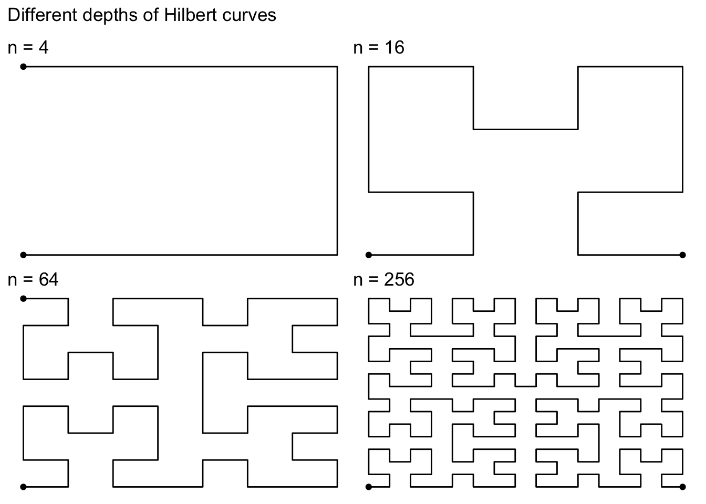
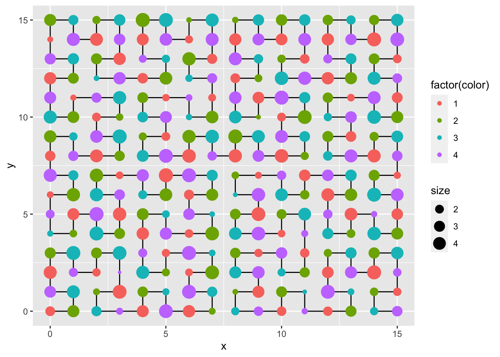
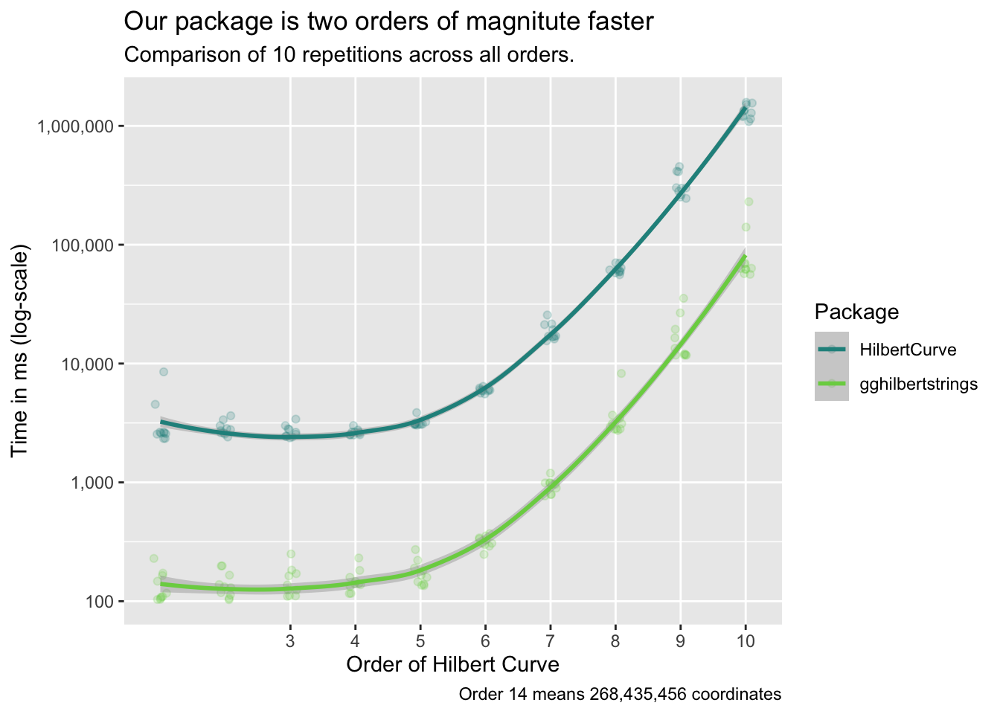
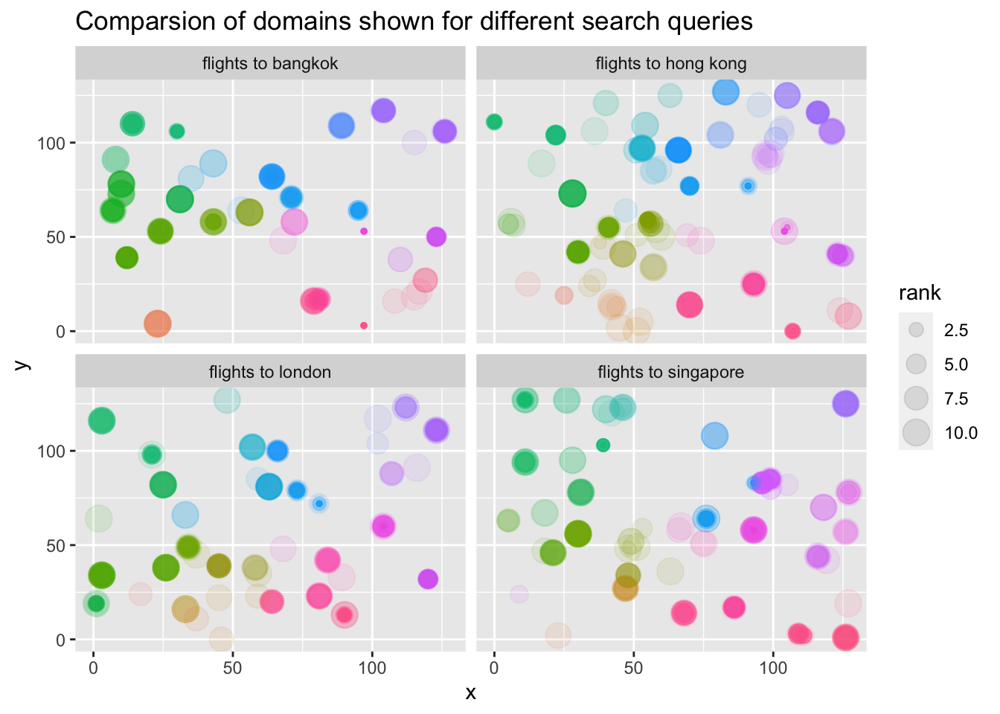

<!-- README.md is generated from README.Rmd. Please edit that file -->

# gghilbertstrings

<!-- badges: start -->

[](https://travis-ci.com/Sumidu/gghilbertstrings)
[](https://ci.appveyor.com/project/Sumidu/gghilbertstrings)
[](https://codecov.io/gh/Sumidu/gghilbertstrings?branch=master)
[](https://lifecycle.r-lib.org/articles/stages.html)
<!-- badges: end -->

A [Hilbert curve](https://en.wikipedia.org/wiki/Hilbert_curve) (also
known as a Hilbert space-filling curve) is a continuous fractal
space-filling curve first described by the German mathematician David
Hilbert in 1891, as a variant of the space-filling Peano curves
discovered by Giuseppe Peano in 1890 (from Wikipedia).

This package provides an easy access to using Hilbert curves in
`ggplot2`.

## Installation

You can install the released version of gghilbertstrings from
[CRAN](https://CRAN.R-project.org) with:

``` r
install.packages("gghilbertstrings")
```

You can install the development version from
[GitHub](https://github.com/) with:

``` r
# install.packages("remotes") # run only if not installed
remotes::install_github("Sumidu/gghilbertstrings")
```

## Usage

The `gghilbertstrings` package comes with functions for fast plotting of
Hilbert curves in ggplot. At it’s core is a fast RCpp implementation
that maps a 1D vector to a 2D position.

The `gghilbertplot` function creates a Hilbert curve and plots
individual data points to the corners of this plot. It automatically
rescales the used `ID`-variable to the full range of the Hilbert curve.
The method also automatically picks a suitable level of detail able to
represent all values of `ID`.

The following figure shows different hilbert curves for different
maximum `ID`s.


### Plotting random data

The most simple way to plot data is to generate an `id` column that
ranges from 1 to n, where n is the largest value to use in the Hilbert
curve. Beware: The `id`s are rounded to integers.

``` r
library(gghilbertstrings)

# val is the ID column used here
df <- tibble(val = 1:256, 
       size = runif(256, 1, 5),        # create random sizes 
       color = rep(c(1,2,3,4),64))     # create random colours

gghilbertplot(df, val, 
                color = factor(color), # render color as a factor
                size = size, 
                add_curve = T)         # also render the curves
```



### Performance

We run the creation of a coordinate system 10 times. This means creating
1 entry for every possible corner in the Hilbert Curve.

``` r
library(microbenchmark)
library(HilbertCurve)
library(tidyverse)
library(gghilbertstrings)
mb <- list()
for (i in 1:10) {
  df <- tibble(val = 1:4^i,
               size = runif(4^i, 1, 5),
               # create random sizes
               color = rep(c(1, 2, 3, 4), 4^(i - 1)))
  values <- df$val
  mb[[i]] <- microbenchmark(times = reps,
                     HilbertCurve = {
                       hc <- HilbertCurve(1, 4^i, level = i, newpage = FALSE)
                     },
                     gghilbertstrings = {
                       ggh <- hilbertd2xy(n = 4^i, values)
                     })
}
```



### Useful example

We use the `eliasdabbas/search-engine-results-flights-tickets-keywords`
data set on
[Kaggle](https://www.kaggle.com/eliasdabbas/search-engine-results-flights-tickets-keywords)
as an example for a simple analysis. We map the full search URLs to the
Hilbert curve and then add points when the URL was present for a
specific search term. By comparing resulting facets we can see
systematic difference in which provides show up for which search term.



Link:
<https://www.kaggle.com/eliasdabbas/search-engine-results-flights-tickets-keywords>
under License CC0
